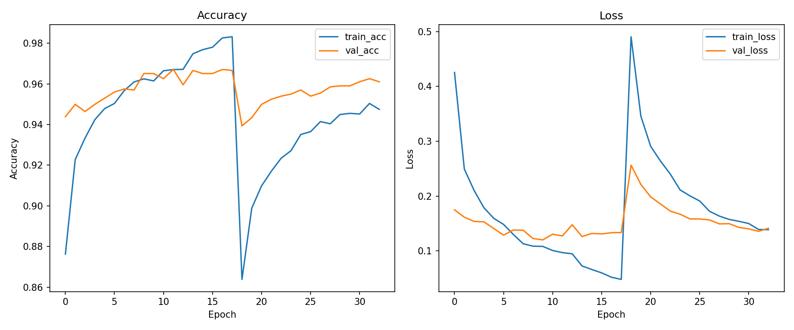
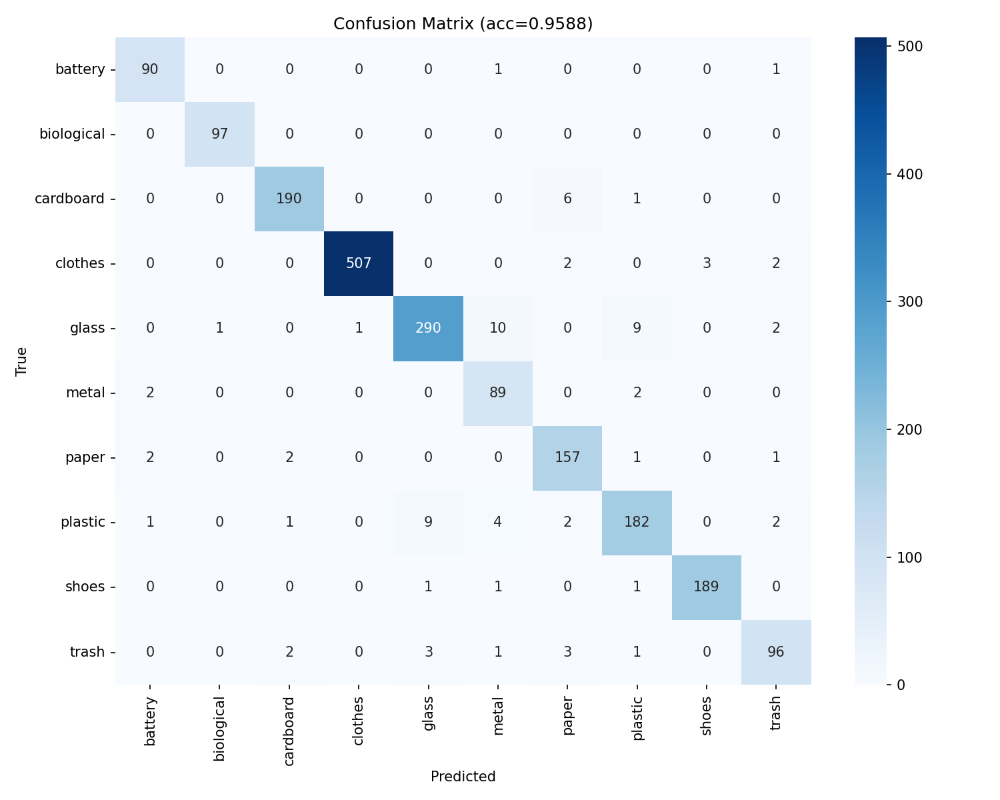

# ♻️ Garbage Classification for Sustainability  
Deep Learning–Powered Waste Sorting System using TensorFlow & EfficientNet

---

## 📌 **Overview**
This project aims to classify waste images into **10 different garbage categories** to support recycling and sustainability initiatives.  
It uses **EfficientNet**, **Transfer Learning**, and a custom **Streamlit dashboard** for real-time predictions.

---

## 🧠 **Features**
- 🔍 Garbage classification into 10 categories  
- 🧠 Transfer learning with EfficientNetB0  
- 📈 Training curves visualization  
- 📊 Confusion matrix analysis  
- 🧪 Classification report with precision/recall/F1  
- 🌐 Streamlit dashboard for fast inference  
- 🧼 Automatic corrupt image cleaner  
- ⚖️ Class-weighting for imbalance handling  

---

## 🗂️ **Dataset**
Dataset: Garbage Dataset with 10 classes (battery, biological, cardboard, clothes, glass, metal, paper, plastic, shoes, trash)

---

## 🧠 **Model Architecture**
### ✔️ Base Model  
- EfficientNetB0 (ImageNet pretrained)  
- Frozen convolution layers (initial training)  

### ✔️ Custom Classification Head  
- GlobalAveragePooling  
- Dense → Dropout  
- Softmax output  

### ✔️ Fine-Tuning  
- Unfreeze last 30 layers  
- Small learning rate (1e-5)  
- Achieves **95%+ test accuracy**

---

## 🔧 **Training Pipeline**
- Image cleaning (JPEG conversion & corrupt image removal)  
- Data augmentation  
- 80/10/10 train-validation-test split  
- Class weighting  
- Callbacks:  
  - EarlyStopping  
  - ModelCheckpoint  
  - ReduceLROnPlateau  

---

## 📊 **Training Results**

### ### 📈 Accuracy & Loss Curves

### ### Confusion Matrix

